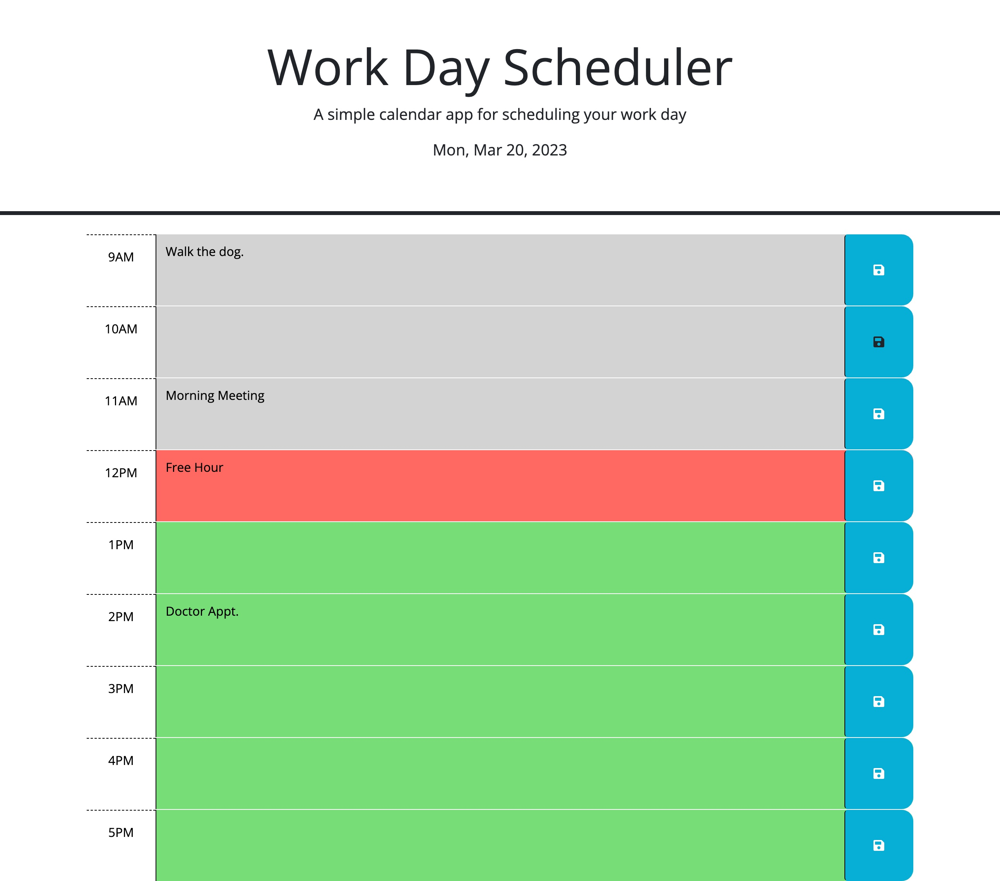

# Homework 05 - Work Day Scheduler

## Description

For this assignment, I was tasked with finishing a website to act as a work day calendar. I was given the base HTML, CSS, and JavaScript code and needed to flesh out each part so that it would come together as a usuable site to plan a workday schedule.

## Installation

N/A

## Usage

The user will be presented with a webpage displaying the current date at the top of the screen along with entry row for each hour between 9 am and 6 pm. Each row is color coded to be a past hour (gray), present hour (red), and a future hour (green). In the screenshot below, the example is set to 2 pm to indicate the color scheme.

To add an entry, simply click in the row for the desired hour, add the text, and click the blue save button at the far right of the row. The entry is now saved and upon refreshing the website, the entry will remain. To delete the entry, click in the row, deleted the desired text, and click save again. 

## Credits

Thank you Bryan and Shawn for pointing me in the right direction for my code. I used W3 schools to research and fill in the gaps, along with my friend (and coder) Cameron who helped me with the tricky bits. Finally, I used ChatGPT to debug the final stretches.

## License

Please refer to the LICENSE in the repository.

## Deloyed

Github: https://github.com/JasperJackalope/05homework-scheduler

Website: https://jasperjackalope.github.io/05homework-scheduler/